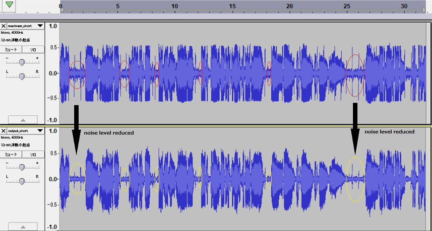

# Spectral Subtraction

This is a simple python code of spectral subtraction. No advanced one.  

[github repository](https://github.com/shun60s/spectral-subtraction)  

## Purpose

There was old, a low quality analog recording source (4KHz sampling, mono) which includes noise to strike ears.  
It's an indian mantra. It consists of human voice and background noise.  
In order to make the souce sound soften to hear, apply noise reduction method by spectral subtraction.  

The figure below is a comparison the source waveform and noise reduced waveform by this spectral subtraction.  
  
  
  
  

In the samples folder, there are used wav files and noise reduced output wav file.  

## Usage
Please see the description in ss1.py.  
In this time, noise only wav file was made by manual using Audacity.  
Get only noise portions from the source waveform and just concatenates them.  

## Disclaimer
THE SOFTWARE IS PROVIDED "AS IS", WITHOUT WARRANTY OF ANY KIND, EXPRESS OR IMPLIED,  
INCLUDING BUT NOT LIMITED TO THE WARRANTIES OF MERCHANTABILITY, FITNESS  
FOR A PARTICULAR PURPOSE AND NONINFRINGEMENT. IN NO EVENT SHALL  
THE AUTHORS OR COPYRIGHT HOLDERS BE LIABLE FOR ANY CLAIM, DAMAGES OR OTHER LIABILITY,  
WHETHER IN AN ACTION OF CONTRACT, TORT OR OTHERWISE, ARISING FROM,  
OUT OF OR IN CONNECTION WITH THE SOFTWARE OR THE USE OR OTHER DEALINGS IN THE SOFTWARE.  

